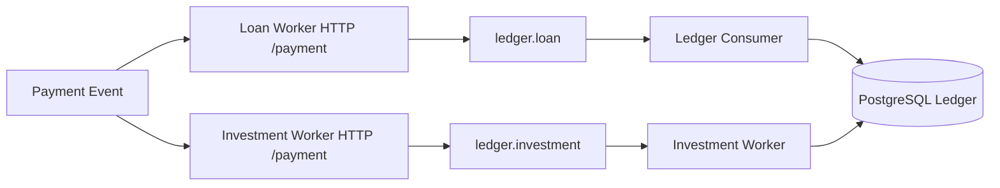

# Architecture

## What This Page Covers

- Runtime services
- Ports
- Queue topology
- High-level processing flow

## Runtime Components

| Component         | Entry Point                 | Protocol        | Purpose                                                              |
| ----------------- | --------------------------- | --------------- | -------------------------------------------------------------------- |
| Ledger API        | cmd/ledger/main.go          | HTTP            | Exposes account, transaction, investment, and withdrawal endpoints   |
| Ledger Consumer   | cmd/ledger-consumer/main.go | RabbitMQ        | Processes command messages and posts transactions                    |
| Investment Worker | cmd/investment/main.go      | RabbitMQ + HTTP | Processes investment messages, schedules accruals, dispatches outbox |
| Loan Worker       | cmd/loan_worker/main.go     | RabbitMQ + HTTP | Processes loan payment events and unresolved routing                 |

Important: `cmd/loan_worker/main.go` currently declares `package loanworker`, so it is not directly runnable with `go run` until changed to `package main`.

## Ports

| Port | Service                | Endpoint Scope             |
| ---- | ---------------------- | -------------------------- |
| 8080 | Ledger API             | Core ledger REST endpoints |
| 8081 | Loan Worker HTTP       | /payment, /health          |
| 8082 | Investment Worker HTTP | /payment, /health          |

## Message Topology

| Queue Key         | Current Value in config.yaml | Used By                      |
| ----------------- | ---------------------------- | ---------------------------- |
| queues.loan       | ledger.loan                  | Ledger Consumer, Loan Worker |
| queues.investment | ledger.investment            | Investment Worker            |
| queues.unresolved | payment.unresolved           | Loan Worker                  |

The queue config struct also defines additional keys:

- accrual_notice
- investment_accrued
- withdrawal.requested
- withdrawal.processed
- maturity_notice

If these keys are used at runtime, add them to config.yaml.

## Processing Flow

## Source Of Truth

- HTTP routes: internal/transport/router.go
- Worker HTTP endpoints: cmd/httpHandler/handler.go
- Service startup and ports: cmd/\*/main.go
- Queue and retry config schema: internal/rabbitmq/config.go
- Active runtime config values: config.yaml
